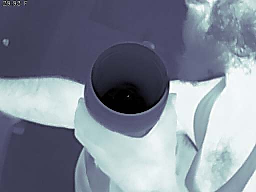

# cppThermalCamera

read the thermal data from a topdon TC001 thermal camera




# Controls

```shell
keymap:
    z x | scale image + -
     m  | cycle through Colormaps
     p  | save frame to file
    r t | record / stop (Not Implemented!)
     q  | quit
```
