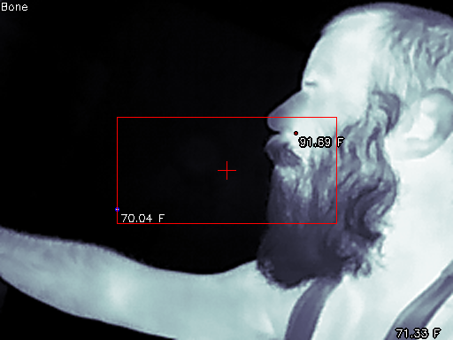

# cppThermalCamera

read the thermal data from a topdon TC001 thermal camera




# Controls

```shell
keymap:
     i  | toggle information
     c  | toggle crosshair
     w  | toggle temp conversion
     h  | toggle High/Low points
    b n | thermalSearchArea - +
     m  | cycle through Colormaps
     p  | save frame to file
    r t | record / stop
     q  | quit
```

# TODO 

